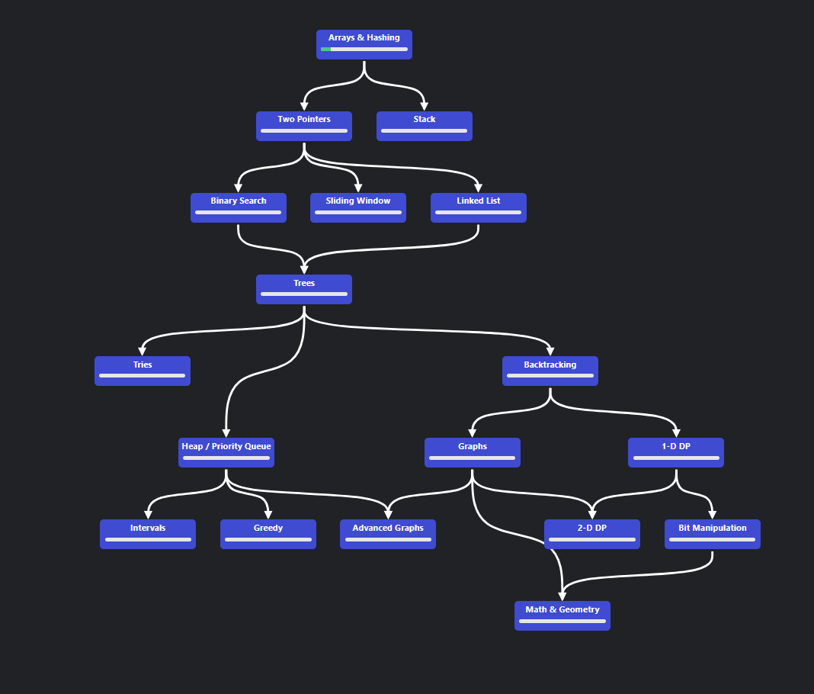

# neetcode-practice
This is a repo used for practicing ```Neetcode 150 questions``` on neetcode.io, learning datastructures in a systematic way. All these questions follow the roadmap design given below.


